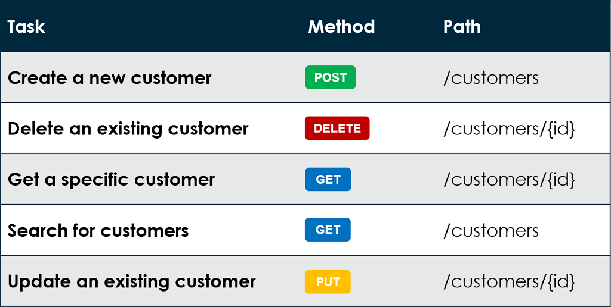
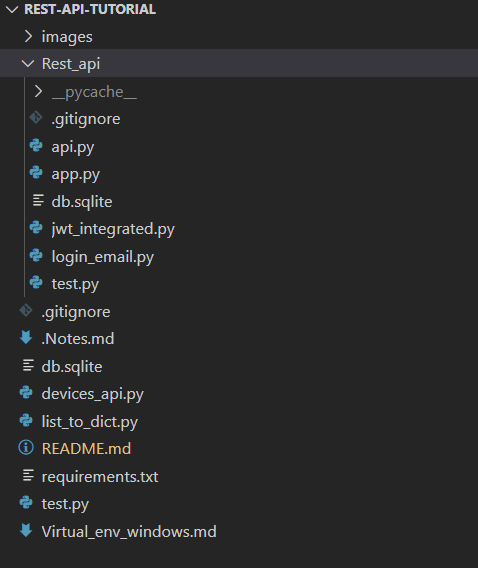

## Rest API with flask and SQLAlchemy.

### [What is REST API:](https://en.wikipedia.org/wiki/Representational_state_transfer)

**Representational state transfer** is a software architectural style that defines a set of constraints to be used for creating Web services. Web services that conform to the REST architectural style, called RESTful Web services, provide interoperability between computer systems on the internet

### What are various HTTP methods:

- This repository contains various files. The file structure of this repository looks like this:

- The first file to look into is **app.py** present in Rest_api directory.

- **app.py** is the most basic file that will provide the code for creating basic GET, POST, PUT, DELETE methods.

