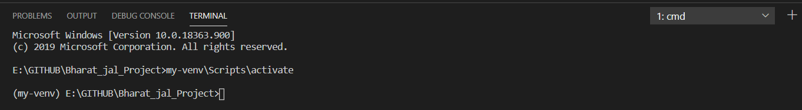

## [Setting Up Virtual Environment in Windows.](https://youtu.be/x1cbYa2SSlE)

### Step 1. Initiating python in CMD.

**Command: python or py**

E:\GITHUB\Bharat_jal_Project>py
Python 3.8.3 (tags/v3.8.3:6f8c832, May 13 2020, 22:20:19) [MSC v.1925 32 bit (Intel)] on win32
Type "help", "copyright", "credits" or "license" for more information.
>>>

- if path is added to your variable it might respond to python and if not py will work. If both doesn't work refer [this](https://stackoverflow.com/questions/13596505/python-not-working-in-command-prompt)

### Step 2. Installation

- **Command: py -m venv environment_name**

- Remember here py is for activating python.

C:\Users\user>e:

E:\>cd GITHUB\Bharat_jal_Project

E:\GITHUB\Bharat_jal_Project>py -m venv my-venv

E:\GITHUB\Bharat_jal_Project>dir
 Volume in drive E is Projects
 Volume Serial Number is E079-E79A

 Directory of E:\GITHUB\Bharat_jal_Project

05-07-2020  11:02    <DIR>          .
05-07-2020  11:02    <DIR>          ..
05-07-2020  11:02    <DIR>          **my-venv**
05-07-2020  10:24    <DIR>          Rest-Api-Tutorial
05-07-2020  11:00                47 Virtual_env_windows.md
               1 File(s)             47 bytes
               4 Dir(s)  268,156,452,864 bytes free

### Step 3: Activating and Deactivating Virtual Environment.

- 1. Activate:

- **Command: env_name\Scripts\activate**

E:\GITHUB\Bharat_jal_Project>my-venv\Scripts\activate

**(my-venv)** E:\GITHUB\Bharat_jal_Project>

- 2. Deactivate:

- **Command: deactivate**

(my-venv) E:\GITHUB\Bharat_jal_Project>deactivate

E:\GITHUB\Bharat_jal_Project>

##### Sample Error:

- if you are getting this error ["Cannot Access scripts."](https://stackoverflow.com/questions/56199111/visual-studio-code-cmd-error-cannot-be-loaded-because-running-scripts-is-disabl)

**NOTE: if you are running a project in VSCODE, remember to set powershell as your default terminal or open your cmd as your terminal, like i did.**

